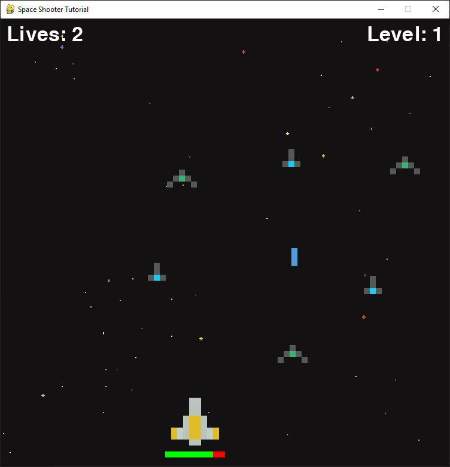

# Space Invaders
🚀 Space Invaders is a shooting game developed using pygame (python). The game space invaders have a simple plotline. Alien invaders have come to Earth. The player is in control of the missile cannon and must destroy all of the Aliens before they reach Earth. The player controls a cannon and can moves left and right on the X-Axis near the bottom of the screen. The Player has three controls, left, right and fire. player objective is to destroy the Aliens before they reach the bottom of the screen. The player receives one point for destroying the one Alien.

## 🤝 Contributing

Contributions, issues and feature requests are welcome! Feel free to check [issues page](https://github.com/gavincapriola/Tetris/issues).

## Show your support
Give a ⭐️ if this project helped you!
